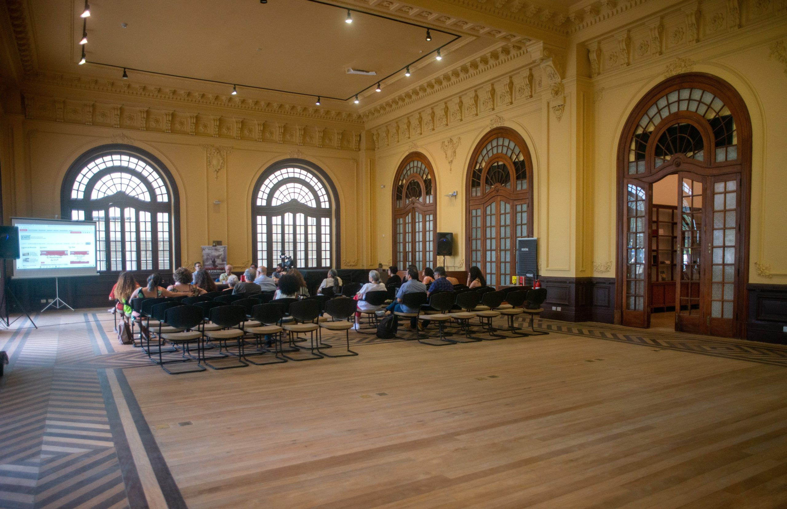
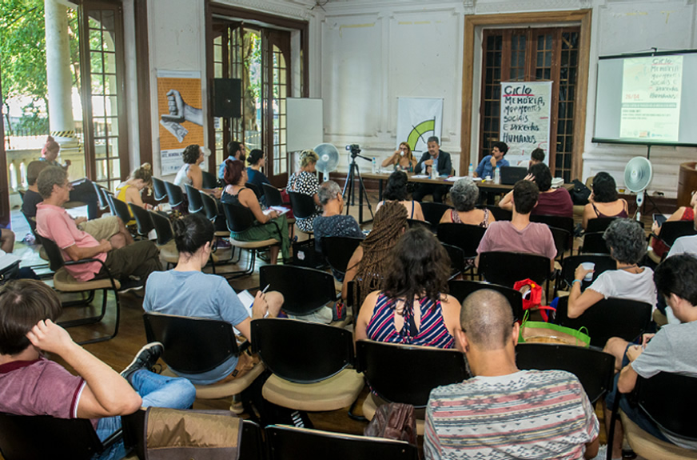
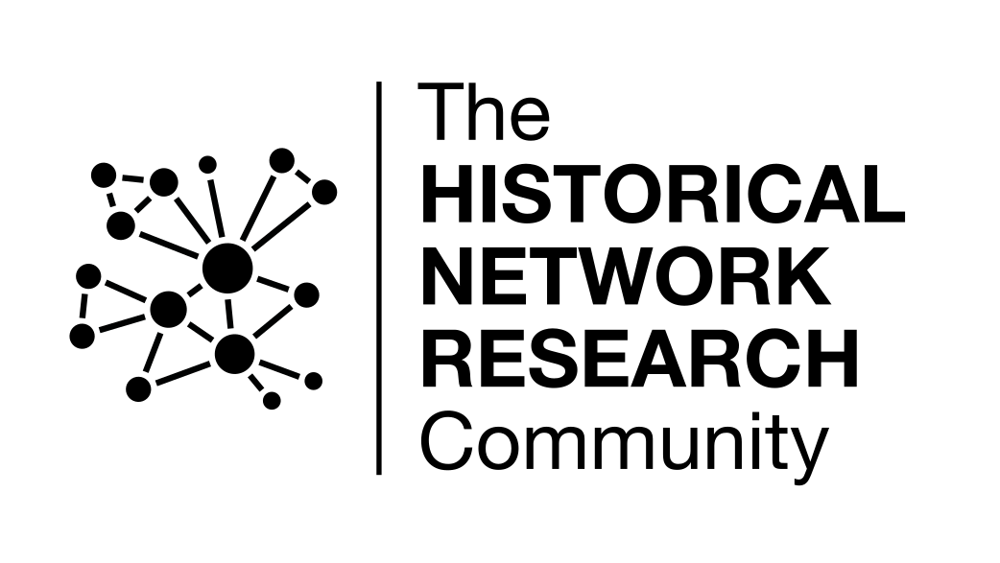
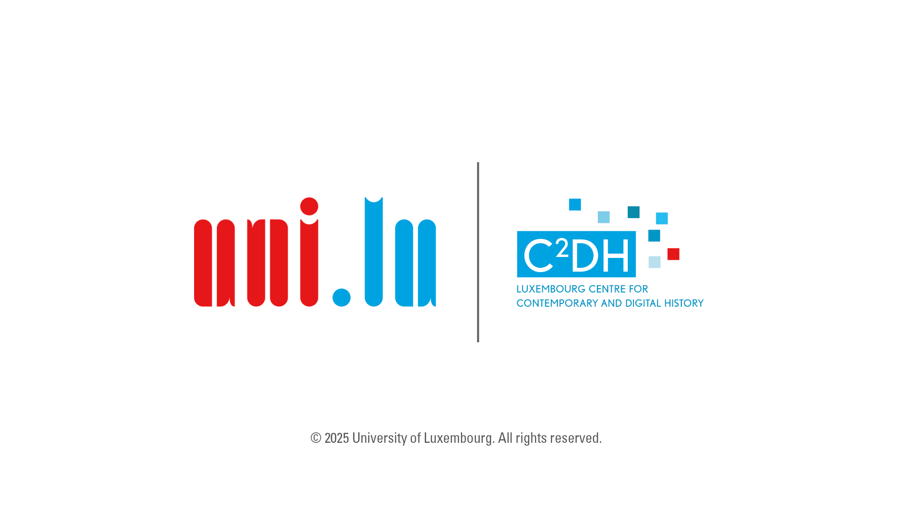

## HNR2025

The 10th International Historical Network Research Conference (HNR2025) will take place on **May 21-23 2025** at the [Forum de Ciência e Cultura](https://forum.ufrj.br/) da Universidade Federal do Rio de Janeiro (UFRJ), Rio de Janeiro, Brazil. It brings together researchers applying network analysis in the historical sciences.

|       |                       |       | 
| ----------- | ----------------------------------- | -------------------- |
| <a href="https://hnr2025.sciencesconf.org">**Registration**</a> Registration is now open and free of charge. &nbsp; &nbsp; &nbsp; &nbsp; &nbsp; &nbsp; &nbsp; &nbsp; | <a href="program">**Program**</a> The preliminary conference program is now available. | <a href="practical">**Practical information**</a> Some information about the location and Rio. | 

    
